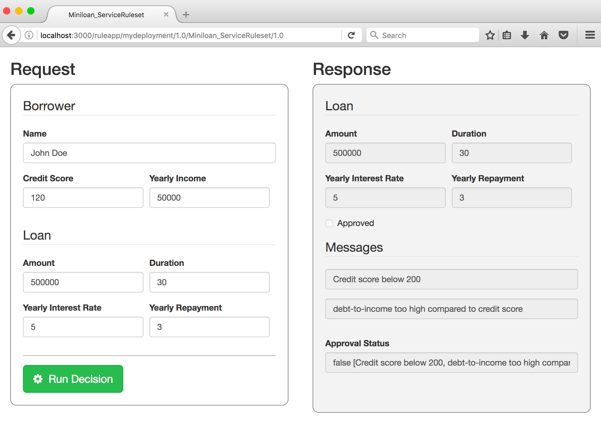

# ODM Decision Forms

[![Build][travis-image]][travis-url]
[![Apache 2.0][license-badge]][LICENSE]
[![Node.js version][nodejs-badge]][nodejs]

A React-based UI to init and run Hosted Transparent Decision Services

## Prerequisites

This package works on top of [IBM Operational Decision Manager](http://www-03.ibm.com/software/products/en/odm). 
It has been tested with [ODM 8.9.0](https://www-01.ibm.com/common/ssi/cgi-bin/ssialias?infotype=OC&subtype=NA&htmlfid=897/ENUS5725-B69&appname=totalstorage#description).
<br>It is also aimed at working with [IBM ODM on Cloud](http://www-03.ibm.com/software/products/en/ibm-operational-decision-manager-on-cloud)
as well as [IBM Business Rules for Bluemix](https://console.bluemix.net/catalog/services/business-rules).

## Features

This package offers a simple web-based UI serving a form representing the input data of a given Decision Service stored in 
ODM Decision Server Rules.
This allows anyone to easily test a Decision Service, without having to write a JSON payload manually.
From this UI, you can trigger the rule service and get a human-readable representation of the output data returned by 
the service.



## Quick Start

Run the server

```bash
odm-decision-forms
```

Then open your browser at:

    http://localhost:3000

## Install

```bash
npm install -g odm-decision-forms
```

## Usage

```
Usage: odm-decision-forms {OPTIONS} {CONFIG}

OPTIONS:

    --env           One of development, production.

    --port          Express server port. Default is 3000.

CONFIG:

    --decisionservice   Url of the Decision Service Runtime. Default is http://localhost:9080/DecisionService

    --console           Url of the RES console. Default is http://localhost:9080/res

    --username          Username to execute the Decision Service. Default is 'resAdmin'.

    --password          Username's password. Default is 'resAdmin'.

```

# Issues and contributions
For issues relating to the HTDS playground, please use the [GitHub issue tracker](../../issues).
We welcome contributions following [our guidelines](CONTRIBUTING.md).

# License
The source files found in this project are licensed under the [Apache License 2.0](LICENSE).

# Notice
© Copyright IBM Corporation 2017.

[travis-image]: https://img.shields.io/travis/ODMDev/odm-decision-forms/master.svg?label=build
[travis-url]: https://travis-ci.org/ODMDev/odm-decision-forms
[license-badge]: https://img.shields.io/badge/license-Apache%202.0-blue.svg
[license]: https://github.com/ODMDev/odm-decision-forms/blob/master/LICENSE
[nodejs-badge]: https://img.shields.io/badge/node->=%206.9-blue.svg
[nodejs]: https://nodejs.org/dist/latest-v6.x/docs/api/
[npm-badge]: https://img.shields.io/badge/npm->=%203.10.8-blue.svg
[npm]: https://docs.npmjs.com/
